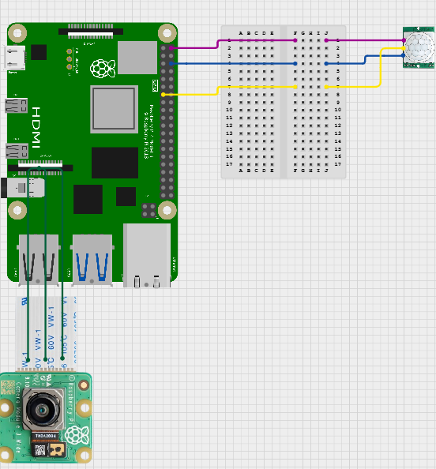

# Motion Activated Camera
For my BlueStamp Engineering project, I built a motion-activated camera system using a Raspberry Pi, a PIR (Passive Infrared) motion sensor, and a camera module that automatically records whenever movement is detected. One of the biggest challenges was troubleshooting hardware and software issues, including camera connectivity, sensor wiring, and video saving, but solving these problems taught me valuable debugging and engineering skills.

| **Engineer** | **School** | **Area of Interest** | **Grade** |
|:--:|:--:|:--:|:--:|
| Aakash P. | Woodbridge High | Chemical Engineering | Incoming Junior


  
# Final Milestone

**Don't forget to replace the text below with the embedding for your milestone video. Go to Youtube, click Share -> Embed, and copy and paste the code to replace what's below.**

<iframe width="560" height="315" src="https://www.youtube.com/embed/F7M7imOVGug" title="YouTube video player" frameborder="0" allow="accelerometer; autoplay; clipboard-write; encrypted-media; gyroscope; picture-in-picture; web-share" allowfullscreen></iframe>

For your final milestone, explain the outcome of your project. Key details to include are:
- What you've accomplished since your previous milestone
- What your biggest challenges and triumphs were at BSE
- A summary of key topics you learned about
- What you hope to learn in the future after everything you've learned at BSE


# Second Milestone

<iframe width="560" height="315" src="https://www.youtube.com/embed/TMUkH07O2Wg?si=3BuRVNTZrkACqizq" title="YouTube video player" frameborder="0" allow="accelerometer; autoplay; clipboard-write; encrypted-media; gyroscope; picture-in-picture; web-share" referrerpolicy="strict-origin-when-cross-origin" allowfullscreen></iframe>

<h2>Technical Progress</h2>

<h3>Pan-Tilt Bracket and Servo Motors</h3>
<p>
For my second milestone, I added a pan-tilt bracket with two servo motors to control the orientation of the camera. The two servo motors allow the camera to rotate horizontally and vertically, giving it a much wider field of view than before. I programmed the system so that pressing the arrow keys moves the servo motors, allowing the camera to be manually positioned in different directions. This is an important step toward the final goal because it provides the hardware and software needed for the camera to automatically track moving objects.
</p>

<h2>Challenges</h2>

<p>
The biggest challenge I faced during this milestone was getting the servo motor demo to run correctly. Initially, my computer could not locate the required demo files, so I was unable to test the pan-tilt bracket. After spending time troubleshooting, I discovered that my computer had named the test file <code>run_servo</code>, while the instructions referred to it as <code>RunServoDemo</code>. Once I identified the correct file, I was able to successfully run the demo, verify that both servo motors were working properly, and continue integrating them into my project. This experience showed me how small differences in file names can create unexpected problems during development.
</p>

<h2>Next Steps</h2>

<p>
For my final milestone, I plan to program the camera so it can automatically detect and track intruders instead of relying on manual controls. This will require implementing motion detection to identify when an object enters the camera's view and determining the direction it is moving. The software will then control the two servo motors to continuously reposition the camera so it follows the moving object while recording. Once this functionality is complete, I will continue testing and refining the tracking system to improve its accuracy, responsiveness, and overall reliability.
</p>


# First Milestone

<iframe width="560" height="315" src="https://www.youtube.com/embed/_1QczBJIH1c?si=EaZqRpuG1uguBnfq" title="YouTube video player" frameborder="0" allow="accelerometer; autoplay; clipboard-write; encrypted-media; gyroscope; picture-in-picture; web-share" referrerpolicy="strict-origin-when-cross-origin" allowfullscreen></iframe>

<h2>Technical Progress</h2>

<h3>Setting Up the Raspberry Pi</h3>
<p>
I started by setting up the Raspberry Pi and installing Raspberry Pi OS. After connecting to the Raspberry Pi, I downloaded and configured all of the software and libraries needed for the project, including the camera libraries required for the Raspberry Pi Camera Module. To remotely access my Raspberry Pi, I used a software called RealVNC Viewer.
</p>

<h3>Camera Module</h3>
<p>
The Raspberry Pi Camera Module connects directly to the Raspberry Pi through a white cable. After enabling the camera software and installing the correct libraries, I tested the camera by recording videos. Once the camera was working, I integrated it into my motion detection program so it would automatically begin recording when motion was detected.
</p>

<h3>PIR Motion Sensor</h3>
<p>
The Passive Infrared (PIR) motion sensor is connected to the Raspberry Pi through its GPIO pins. The sensor detects changes in infrared radiation caused by movement and sends a signal to the Raspberry Pi when motion is detected. My program monitors this signal and starts recording with the camera. When motion stops, the program waits five seconds before ending the recording.
</p>

<h2>Challenges</h2>

<p>
One of the biggest challenges I encountered was that the Raspberry Pi would not recognize the camera. After troubleshooting, I found that the required camera library had not been installed, preventing the camera from connecting properly. Another challenge was that the PIR sensor was wired incorrectly, causing it to continuously report motion even when nothing was moving. By checking the hardware connections, installing the correct software, and debugging my code, I was able to solve these problems and sucessfully complete my base project.
</p>

<h2>Next Steps</h2>

<p>
For my next milestone, I plan to add two servo motors that will allow both the camera and the PIR sensor to rotate and follow a moving person. Instead of recording only within a fixed field of view, the system will be able to track movement as it occurs. After integrating the servo motors with the existing hardware and software, I will continue testing and refining the system to improve its accuracy and reliability.
</p>

# Schematics 



# Code
Here's where you'll put your code. The syntax below places it into a block of code. Follow the guide [here]([url](https://www.markdownguide.org/extended-syntax/)) to learn how to customize it to your project needs. 

```python
from gpiozero import MotionSensor
from picamzero import Camera
from datetime import datetime
import time

pir = MotionSensor(27)
cam = Camera()

print("Ready!")

while True:
    time.sleep(3)
    pir.wait_for_motion()
    print("Motion detected!")
    
    # 1. Generate a brand NEW unique filename with the exact timestamp
    current_time = datetime.now()
    filename = f"{current_time:%Y-%m-%d_%H-%M-%S}"
    
    # 2. Start recording to this unique file
    cam.start_recording(filename)
    
    # 3. Wait for them to stop moving, THEN record for an extra 5 seconds
    pir.wait_for_no_motion()
    print("Motion stopped. Recording 5 more seconds.")
    time.sleep(5)
    
    # 4. Safely close and seal the video file
    cam.stop_recording()
    print(f"Video saved successfully as {filename}.mp4")
```

# Bill of Materials

| **Part** | **Note** | **Price** | **Link** |
|:--:|:--:|:--:|:--:|
| Raspberry Pi 4 Starter Kit | Raspberry Pi System | $148.99 | <a href="https://www.amazon.com/RasTech-Raspberry-Starter-Heatsink-Screwdriver/dp/B0C8LV6VNZ/ref=sr_1_1?crid=2454KC70JASX7&dib=eyJ2IjoiMSJ9.K9uYbZ89dSGaSC_vJVVn_gSMB_2K_t0Zmmay-i6VDhvUfs0YQUoIt02ea2cnBhUy5MOcyKrMolJt2Y_dEMG7Xyq8MAdT9FDe5RRD3Rhjq-Z3EKg36QWi9M2AKafmTrwGmbxfbVuwFjkjwQrkryoCvWcSbeTtXW2llkUD6sSi182vxFjX1MX3pD4FS7TwoYTL3CfXhm-G-dUNQulLNuuHx44zelW2oS0ctFeb-g7n78c.04CbwfKk7SmNoTBQfiJC3X1_7s4zBIeBZAHkHsObO8w&dib_tag=se&keywords=raspberry%2Bpi%2B4%2Brastech&qid=1782846712&sprefix=raspberry%2Bpi%2B4%2Brastech%2Caps%2C186&sr=8-1&th=1"> Link </a> |
| Electronice Fun Kit | Electronics | $15.99 | <a href="https://www.amazon.com/BOJACK-Electronics-Potentiometer-tie-Points-Breadboard/dp/B099MQV8ZW/ref=sr_1_3?crid=24D0BJ9GV5RVC&dib=eyJ2IjoiMSJ9.vwmDmowVlgaQ04Sl7p19oPnaT4Mk-Fp6-UvLCYTsR1kGQk12r4Iv6QPTMR8UQBbI-dRQLrZzBBC0mMcf-4GNrdN1DfY3QVCZ3e_1Xqn6SaWx1KYqdK27pmTP895Rq1L_GMCAK6nmXlxQIp591aCNcXSnFhyFV18kXKEB3CjglIcwhggemsdzzTpMHClN_5Lde8wgCipRX4WeBMJg8fXwynnLRg9Ao_iT9dnS66OOopg.186F3X-zATFbUcDdO042XYoT1Q3-nx9_SUZF5hEJbYQ&dib_tag=se&keywords=bojack+electronice+fun+kit&qid=1782847087&sprefix=bojack+electronice+fun+kit%2Caps%2C190&sr=8-3"> Link </a> |
| PIR Sensor | Infared Motion Sensor | $8.49 | <a href="https://www.amazon.com/HiLetgo-HC-SR501-Infrared-Sensor-Arduino/dp/B07KZW86YR/ref=sr_1_1?crid=3EDNVSHT2AX4T&dib=eyJ2IjoiMSJ9.TR4qEZq53NyS78IwE9mqddHGYsJpQINtJ5Mp7mHH-p0ogvqw8dzbdrj0Tjshri_IW1cZqttenHbS5IE79SdVn4pWAdYFRKwZpGnQdLC164Cfp9fknPbYp0yHtH0NtrCw763XTR-QnDJSuiTUJF3r8MDwxoPhob6w26zFqhR-8pd7rTpRFSFiKh-TaQs-8a_i7w3_YTobc9hfIj55S8RsIeCKCRUuwz7xLZBPLjO9WnU.8VKpeTKqlS4t3npzHqBmIpHJ53cIlyRCkibriXDRvL8&dib_tag=se&keywords=hiletgo+3pcs+hc+sr501+pir+infrared+ir+sensor&nsdOptOutParam=true&qid=1782847220&sprefix=hiletgo+3pcs+hc+sr501+pir+infared+ir+sensor%2Caps%2C220&sr=8-1"> Link </a> |
| Camera Module | Recording Module | $6.99 | <a href="https://www.amazon.com/Arducam-Megapixels-Sensor-OV5647-Raspberry/dp/B012V1HEP4/ref=sr_1_2?crid=1KTBK7ZWQF4UV&dib=eyJ2IjoiMSJ9.6WrYADCMjOY9gW5mqaDlpOzGKbxS4R3uAvvyumgwJMki2J7_2Kx-yMoRddNQfUbQY6XY39xVwNq6SVXAwQ8s1WDmvXlM_30n1mIQQmgdlMfYkoV_4y1-Fy0fX9bFbLAHvniKkXHd3r8g1VH_SCLxhUF6vtPXTDlR01PgTlIj_VbthWrJIntW_iPXtEbksoQb0cwDCyfy5ddnI58CgMXYvWKq3jyaAEvfxz-aGYe-qQc.a1w9dUyu-Fl6RzjX86nPv5URDjr5aL88wLpW-9aCalY&dib_tag=se&keywords=raspberry%2Bpi%2BCamera%2Bmodule%2Bsunny&qid=1782847539&sprefix=raspberry%2Bpi%2Bcamera%2Bmodule%2Bsunny%2Caps%2C183&sr=8-2&th=1"> Link </a> |
| Pan-Tilt Bracket | Servo Motors and Bracket | $26.99 | <a href="https://www.amazon.com/Arducam-Upgraded-Camera-Platform-Raspberry/dp/B08PK9N9T4/ref=sr_1_1?crid=3AH05G5JEZN77&dib=eyJ2IjoiMSJ9.B5mD8rF26ZHdnP0N63uXR4XYalhMxdjRy_J9_J16YwXNiaD4dkaC_etKz39i84S6oiyfOuGkeOLN1Ct1XZJR46vrlKK7-bM88yAl_CjQ94H5r68115kxJzNCFtKZJipMdLkqgKXdc1ydbKJrCHBjTFEq8Zy1W0rr9hTuP5nEjwT1nCIaRMsl6b3SoE0rF0iN1Lx-B04S2cKLURzMCAeZ4RBnYdf97sJTvRw_fZJAvhc.TFPe9H7krCP6TBd0Zbox1exYFoL6gT33sOOFjSb9xT8&dib_tag=se&keywords=arducam+pan+tilt&qid=1783715395&sprefix=arducam+pan+til%2Caps%2C430&sr=8-1"> Link </a> |

# Other Resources/Examples
One of the best parts about Github is that you can view how other people set up their own work. Here are some past BSE portfolios that are awesome examples. You can view how they set up their portfolio, and you can view their index.md files to understand how they implemented different portfolio components.
- [Example 1](https://trashytuber.github.io/YimingJiaBlueStamp/)
- [Example 2](https://sviatil0.github.io/Sviatoslav_BSE/)
- [Example 3](https://arneshkumar.github.io/arneshbluestamp/)
